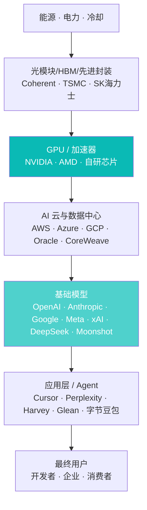

# 2026 年 AI 行业格局总览

> 最后更新：2026-04-22
>
> 本文是 AI 板块的**入口总览**，会频繁链接到单家公司、单个产品的深度调研页。数据截至 2026 年 Q1，**以公开披露与头部机构研报为主**，每条数字都标注来源。

## 摘要（TL;DR）

1. **基础模型层已收敛为"三强 + 追赶者 + 开源"格局**：OpenAI、Anthropic、Google 占据高端市场，DeepSeek / Llama / Qwen 等开源/半开源力量以 10-20 倍的成本优势分食中低端；其余玩家要么找垂直，要么被整合。
2. **利润集中在最上游**：NVIDIA 2025 财年毛利率约 75%，而头部模型公司**综合毛利为负或刚转正**——钱正被**芯片厂 + 云厂** 抽走，应用层在其上薄薄分一层利润。
3. **2026 的关键变量是推理成本**：过去 18 个月 API 价格**平均下降约 80–90%**（Epoch AI / Artificial Analysis 综合数据）——如果再降一个数量级，Agent 和搜索这类"高调用频次"产品将完全重构商业模型；如果不降，则头部玩家将被自身算力折旧拖死。

---

## 一、先看一张全景图

**谁吃掉了多少毛利**（按 2025 年公开披露，粗略量级）：

| 环节 | 代表公司 | 2025 毛利率 |
|---|---|---|
| GPU | NVIDIA | **~75%** (FY2025 Q3 10-Q) |
| AI 云 (AI-related segment) | Azure / AWS / GCP | ~60%（难单独拆，估算） |
| 基础模型 | OpenAI 等 | **负到接近 0**（含折旧算法） |
| 应用层 | Cursor / Perplexity | ~70% 单位经济正，但规模小 |

**反直觉结论**：**越下游越接近用户，越容易赚钱；但当前绝大多数风险资本投向了亏损最严重的基础模型层**。

---

## 二、基础模型层：三强 + 追赶者 + 开源

### 三强格局

| 公司 | 旗舰模型 | 差异化定位 | 商业重心 |
|---|---|---|---|
| **OpenAI** | GPT-5 / o 系列 | 通用性最强、产品形态最多 | ChatGPT 订阅 + API + 企业 |
| **Anthropic** | Claude Opus / Sonnet / Haiku 4 系列 | 代码 + 企业侧口碑最好 | 企业 API（比重高于订阅） |
| **Google DeepMind** | Gemini 2.5 Pro / Flash | 多模态与长上下文强 | 搜索集成 + Workspace + 云 |

**近 18 个月最重要的变化**：**推理模型（Reasoning Models）成为行业共识**。从 2024 年 9 月 OpenAI `o1` 首发，到 2025 年 DeepSeek R1 开源、Claude 4 系列将 extended thinking 内建、Gemini 2.5 Pro 全系带 thinking——**所有头部模型都已经是"可显式思考 + 可工具调用"的 Agent 底座**。详见 [推理模型专题](推理模型专题_从o1到R1到Claude_Sonnet_4_6.md)。

### 追赶者

- **xAI**：Grok 4 性能已跻身第一梯队，独占 X 平台数据与 Colossus 集群（20 万卡）
- **Meta AI**：Llama 系列奠定了开源世界格局，但应用产品（Meta AI）不温不火
- **Mistral**：欧洲合规卡位 + 开源 weights
- **Cohere**：企业定位，垂直在 RAG / 金融

### 中国梯队

**"六小虎 + 三大厂"**（详见 [中国大模型六小虎格局演变](中国大模型六小虎格局演变.md)）：

- **领跑**：**DeepSeek**（V3/R1 以 1/10 训练成本冲击国际市场）、**Moonshot**（Kimi，2026 Q1 K2 发布）
- **梯队二**：智谱 AI、MiniMax、阿里通义、字节豆包/Seed
- **吃紧**：百川、阶跃、腾讯混元

中国梯队集体选择了**开源 + 性价比**路线——DeepSeek V3/R1 以开源打法在 2025 年初把全球开源模型基准一把推高，显著改变了国际对"中国模型能力"的认知。

### 开源层

- **Llama**（Meta）生态最大
- **Qwen**（阿里）在中文圈主导地位
- **DeepSeek** 是最接近闭源的开源
- **Mistral** 欧洲阵营
- **Gemma**（Google）走小模型路线

**开源 vs 闭源之争**的现状：
- 开源和闭源的能力差距**从 12 个月缩到 3-6 个月**
- 但**最前沿的推理能力**、**最长的上下文**、**最强的工具使用**仍然在闭源
- 详见 [开源vs闭源 生态格局演变](开源vs闭源_生态格局演变.md)

---

## 三、基础设施层：NVIDIA 一超，云厂加 capex

### GPU

**NVIDIA** 仍然独霸——2025 年数据中心 GPU 市占率>90%。旗舰产品演进：
- **H100** (Hopper) → **H200** → **B100/B200** (Blackwell, 2025 量产) → **Rubin** (2026-2027)

**挑战者**：
- **AMD MI300X / MI325X**：第二名，生态在建
- **Google TPU v5p / Ironwood v7**：自用为主，Gemini 训练
- **Amazon Trainium 2 / 3**：AWS 自研，Anthropic 深度合作
- **Cerebras / Groq**：推理专用芯片，长尾玩家

### 云厂 capex 军备竞赛

根据 2025 Q4 财报摘要：
- Microsoft FY26 capex 指引：**$80B+**
- Google 2025 capex：**~$75B**
- Meta 2025 capex：**~$40B**
- Amazon 2025 capex：**$100B+**（含非 AI）
- **四家合计 2025 capex 约 $300B**——人类历史上最贵的短期资本投入

### 数据中心与电力瓶颈

- 美国：北弗吉尼亚、凤凰城、德州成为超级节点
- 缺电是真事——**2025 年 Microsoft 重启三里岛核电站**给 AI 数据中心供电
- 中国：国家数据局"东数西算"调度至西部绿电节点

---

## 四、应用层：从 Copilot 走向 Agent

### Coding

格局清晰：**Cursor（Anysphere）** 在开发者中占据头部，**Claude Code**（Anthropic）、**Windsurf**、**GitHub Copilot**、**字节 Trae** 紧追。详见 [AI Coding 产品格局](../../05_AI互联网/01_行业研究/AI_Coding产品格局_Cursor_Windsurf_Claude_Code.md)。

### 搜索与浏览器

- **Perplexity** 开辟新品类，收购 Comet 推浏览器
- **OpenAI SearchGPT / ChatGPT Search**
- **Google AI Overviews** 直接融入主搜
- 详见 [生成式搜索革命](../../05_AI互联网/01_行业研究/生成式搜索革命_Perplexity_SearchGPT_AI_Overviews.md)

### 企业工具

- **Glean**（企业内搜）、**Harvey**（法律）、**Hebbia**（投研）、**Abridge**（医疗）——每个垂直都跑出 2-3 家头部
- **AlphaSense** 在投研侧吃金融场景（详见 [AI 金融板块](../../04_AI金融/index.md)）

### Agent

**通用 Agent**（还在雏形）：
- **Claude Code 与 Computer Use**：Anthropic 工程味道最浓
- **ChatGPT Operator / Agent mode**
- **Manus**（中国）、**OpenAI Swarm** 等实验

**垂直 Agent**：Devin（Cognition）已从狂热回归理性；Sales / Support / Recruiting 垂直 Agent 开始兑现 ROI。

---

## 五、2026 的五个关键变量

### 1. 推理成本下降速度
- 基准：GPT-4 API 输入 token 价格从 2023 Q1 的 $30/M 降到 2025 Q4 的 ~$2.5/M（~12× 降）
- **如果 2026 再降 10×**：Agent / 搜索 / 个性化完全重构；当前应用层估值合理
- **如果降速放缓**：头部模型公司财务迅速恶化

### 2. Agent 能力跃迁
- 关键观察指标：**多步任务完成率**（METR 评测、OSWorld、SWE-bench）
- 2024→2025 这一年 Agent 能独立完成的任务长度从**分钟级→小时级**
- **2026 要看能不能到天级 / 工作日级**

### 3. 中美技术管制
- 美国对中国：GPU 出口、EDA 工具、HBM 设备（详见 [AI 训练基础设施 GPU 供需与云厂商格局](AI训练基础设施_GPU供需与云厂商格局.md)）
- 中国对内：大模型备案、内容安全（算法备案 + 深度合成备案）
- 欧盟：AI Act 第一波合规截止（2026-02 GPAI 条款生效）

### 4. 开源 vs 闭源路线
- DeepSeek V4 / Llama 5 / Qwen 4 会不会继续缩小差距
- Meta 会不会在某一代开始**闭源最强的那款**（有先例，Llama 4 Behemoth 未公开 weights）

### 5. 算力资本支出的可持续性
- 问题：**四大云厂 $300B+ 的 capex**，与 AI 相关的**年度收入**（~$50-80B 量级，2025）之间差了 4-5x
- **历史上所有基础设施超投期最终都会经历一次痛苦的出清**（铁路、电信、互联网）
- 这次不同的理由是——"AI 赚钱的是应用，基础设施只是成本" ≠ 历史上的超投 —— **我个人对这个理由持保留态度**

---

## 六、我的判断

> **我的看法**：2026 年最可能发生的 3 件事是——
>
> 1. **推理模型大幅降价**（Claude、Gemini、DeepSeek 继续压低 Token 成本到当前 1/3-1/5）
> 2. **至少一家中国大模型公司停止基础模型训练，转向应用**（"六小虎"继续分化）
> 3. **一次明显的基础设施市场震荡**（某个云厂 capex 回撤或超大单毁约），触发估值 re-rating；**但不是崩盘**
>
> 最不确定的是：**Agent 能不能在今年兑现"小时级→工作日级"的跨越**。如果能，所有基础模型公司的收入曲线会大幅上修；如果不能，商业化压力会迫使路线再分化。
>
> **我可能错在哪里**：
>
> - **路线可能没收敛**：我假设推理模型是主流方向，但某一个新范式（如 world models、agentic pre-training）可能再一次洗牌
> - **中国公司可能更强**：从技术人才密度和工程速度看，中国梯队的追赶不排除再做出一个 DeepSeek 级别的惊喜
> - **capex 拐点可能晚于预期**：只要"AI 收入年增速 > capex 折旧速度"成立，基础设施就能继续烧；而收入增速很可能被低估

---

## 七、延伸阅读

**同板块深度文章**：
- [大模型技术路线对比：Dense / MoE / Reasoning](大模型技术路线对比_Dense_MoE_Reasoning.md)
- [推理模型专题：从 o1 到 R1 到 Claude Sonnet 4.6](推理模型专题_从o1到R1到Claude_Sonnet_4_6.md)
- [AI 训练基础设施：GPU 供需与云厂商格局](AI训练基础设施_GPU供需与云厂商格局.md)
- [AI Agent 行业现状与路线分歧](AI_Agent行业现状与路线分歧.md)
- [中国大模型六小虎格局演变](中国大模型六小虎格局演变.md)

**公司级深挖**：
- [Anthropic](../02_公司调研/Anthropic.md) · [OpenAI](../02_公司调研/OpenAI.md) · [Google DeepMind](../02_公司调研/Google_DeepMind.md)
- [DeepSeek](../02_公司调研/DeepSeek.md) · [Moonshot 月之暗面](../02_公司调研/Moonshot_月之暗面.md)

**姐妹站**：
- 想看**大模型技术原理**（Transformer / Diffusion / RLHF / Constitutional AI）：去 [AI Notes · 人工智能学习笔记](https://jeffliulab.github.io/ai-notes/)

---

## 信息源

- **Stanford HAI, *AI Index Report 2026*** (2026-04)
- **Nathan Benaich, *State of AI Report 2025*** (2025-10)
- **Epoch AI · Artificial Analysis** · API 价格追踪（持续更新）
- **SemiAnalysis** · 算力与 GPU 供需深度
- **McKinsey *State of AI 2025*** · 企业采用数据
- **OpenAI / Anthropic / Google / NVIDIA** 最新财报与 earnings call transcripts
- **The Information** · 独家爆料（需订阅）
- **晚点 LatePost** · 中文一手
