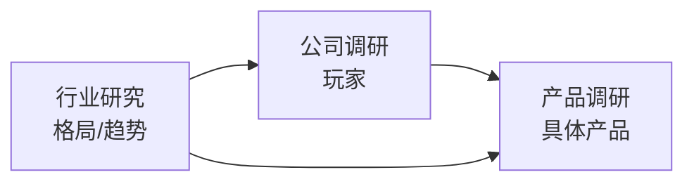

# AI 行业研究

> 大模型、Agent、多模态、AI 基础设施。聚焦技术商业化与竞争格局，不陷入纯技术细节（那部分去 [AI Notes](https://jeffliulab.github.io/ai-notes/)）。

## 本板块怎么读

三个维度互相印证：**趋势**决定**谁能成**，**谁**在做**什么产品**。

## 行业研究

**优先阅读：**
-   [2026年AI行业格局总览](01_市场与资本/AI行业格局2026.md)
-   [大模型技术路线对比 Dense/MoE/Reasoning](02_技术前沿/大模型路线对比.md)
-   [推理模型专题：从 o1 到 R1 到 Claude Sonnet 4.6](02_技术前沿/推理模型专题.md)

全部文章见左侧导航。

## 公司调研

**海外头部**：Anthropic · OpenAI · Google DeepMind · Meta AI · xAI · Mistral · Cohere · Perplexity · Cursor · Harvey · Glean

**中国大模型**：DeepSeek · Moonshot · 智谱 · MiniMax · 阿里通义 · 字节豆包 · 百川 · 阶跃 · 腾讯混元

## 产品调研

**基础模型**：Claude · ChatGPT · Gemini · DeepSeek · Qwen

**Coding 与生产力**：Claude Code · Cursor · Windsurf · v0 · Notebook LM

**多模态**：Sora · Runway · Midjourney
