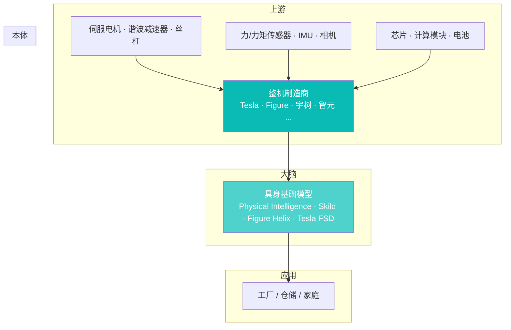

# 人形机器人行业格局 2026

> 最后更新：2026-04-22
>
> 本文是**机器人板块**的入口总览，聚焦**人形机器人**（humanoid robot）——当前产业最热、分歧最大、距离商业化拐点最近的那一档。

## 摘要（TL;DR）

1. **格局**：2026 年初的人形机器人赛道，**全球已有 50+ 家公司量产或接近量产**，形成"**美国 3 强 + 中国 5 强 + 欧洲 2 家**"的头部。头部公司（Tesla / Figure / 宇树）已进入**工厂小批量交付**阶段。
2. **瓶颈**：硬件成本下降快（宇树 G1 售价已低至**约 1 万美元**），但**软件（具身智能大脑）**远没跟上——可靠完成真实世界任务的能力仍是实验室水平。
3. **商业化拐点未至**：2025 年全球人形机器人**出货量 < 5 万台**（TrendForce 估算），**97% 以上用于研发 / 演示 / 工厂试点**，to-C 可忽略。**真正的产品-市场匹配最快要到 2027-2028**。

---

## 一、全景图：从零件到整机

**价值分布**（2025 年，粗估）：

| 环节 | 占 BOM 比例 | 代表厂 |
|---|---|---|
| 关节模组（电机 + 减速器 + 编码器） | **40-50%** | 日本哈默纳科 · 绿的谐波 · 汉宇 · 绿米 |
| 灵巧手 | 10-15% | 因时机器人 · 兆威 · Shadow |
| 传感器 | 5-10% | 六维力矩：宇立 · 鑫精诚 |
| 计算单元 | 5-8% | NVIDIA Jetson Thor / Orin · 寒武纪 |
| 电池 | 3-5% | 宁德时代 · EVE |
| 结构件 / 外壳 | ~10% | 多家 |
| 组装 / 软件 / 分销 | 余下 | 整机厂 |

**关键：谐波减速器 + 丝杠 = 全身成本最厚的一环**。详见 [机器人核心零部件供应链](../02_产业链/核心零部件.md)。

---

## 二、玩家格局：3 + 5 + 2

### 美国 3 强

| 公司 | 产品 | 近期动向 | 估值 / 融资 |
|---|---|---|---|
| **Tesla Optimus** | Gen 2 → Gen 3 在研 | 2025 年末小批量内部工厂测试，Musk 目标 2026 年产数千台 | Tesla 市值的一部分 |
| **Figure AI** | Figure 02 → Figure 03 | 与宝马工厂合作生产线；Helix 自研具身模型 | 2025 Series C ~$2.6B 估值 $40B（待考） |
| **Boston Dynamics** | Atlas Electric | 老牌液压退役，电动 Atlas 进入现代汽车工厂试用 | 现代集团持有 |

详见：[Tesla Optimus](../11_公司研究/Tesla_Optimus.md) · [Figure AI](../11_公司研究/Figure.md) · [Boston Dynamics](../11_公司研究/Boston_Dynamics.md)

### 中国 5 强

| 公司 | 产品 | 动向 |
|---|---|---|
| **宇树 Unitree** | H1 → H2 / G1 | G1 售价 ~$10k 打爆市场；H 系列演示频繁刷屏 |
| **智元 AgiBot** | 远征 / 灵犀 | 华为背景 + 稚晖君，量产工厂上海张江，2025 出货 >1000 台宣称 |
| **优必选 UBTECH** | Walker S | 港股上市，比亚迪 / 一汽试点 |
| **傅利叶 Fourier** | GR-1 / GR-2 | 学术圈与 Figure AI 合作开源数据（Figure 捐数据集） |
| **星动纪元 Robotera** | Star1 / L7 | 清华系，马拉松 / 极限运动演示出圈 |

新晋黑马：**银河通用 Galbot**（具身一体）、**乐聚机器人**（消费级）、**千寻智能**（由 Pony 创始人投资）

### 欧洲 2 家

- **1X Technologies**（挪威 + 硅谷）：NEO 面向家庭场景，OpenAI 战略投资
- **Sanctuary AI**（加拿大）：Phoenix 人形，专注工业

### 其他梯队

- **Apptronik**（美国，Apollo）、**Agility Robotics**（美国，Digit，仓储老牌）、**Neura Robotics**（德国）

---

## 三、技术路线分歧

### 路线 A · "先把硬件做出来再说"

- **代表**：Tesla Optimus、宇树、智元
- **特点**：优先打造**低成本、能量产**的硬件平台，大脑走"**稍微能用就行，成本下来大规模学**"
- **赌注**：**数据飞轮**（量产 → 实网数据 → 训大模型 → 能力提升）

### 路线 B · "先把大脑训出来再说"

- **代表**：Figure AI、Physical Intelligence（合作）、Skild AI
- **特点**：重点研发**具身基础模型**（VLA / World Model），硬件用自研或合作方
- **赌注**：**软件能力是瓶颈而非硬件**，谁先训出"GPT 级"具身模型谁赢

### 路线 C · "专门打一个垂直场景"

- **代表**：Agility Robotics（仓储）、1X（家庭）、Apptronik（工业）
- **特点**：**不追求通用**，把一个场景做透做到 ROI 为正
- **赌注**：**通用人形模型还很远，垂直能先赚到钱**

**我的判断**：2026 这一年，**路线 A 和 B 会继续并行但逐渐合流**（Tesla 肯定在自研具身基础模型、Figure 也必须自建工厂），路线 C **可能先跑出第一个商业模型**（仓储或工厂某个 SKU）。详见 [机器人基础模型 RFM 趋势](../03_大脑与数据/RFM趋势.md)。

---

## 四、市场与商业化

### 出货与渗透

| 年份 | 全球人形机器人出货（估算） | 备注 |
|---|---|---|
| 2024 | <10k 台 | 多为 R&D / 演示 |
| 2025 | ~30-50k 台 | 宇树 G1 贡献大部分，低价刺激研究市场 |
| 2026（预测） | 100-200k 台 | 头部厂进入工厂小批量 |
| 2030（主流机构预测） | 1-2M 台 | 高盛、摩根士丹利、花旗中性预期 |

**注**：**以上只是出货量，不是商业价值**。真正产生持续收入的部署还凤毛麟角。

### 价格带

- **消费 / 研究级**：$10k-20k（宇树 G1、K-Scale 等）
- **工业 / 商用级**：$50k-150k（Figure、Optimus、Atlas Electric）
- **高精度科研**：$250k+（Sanctuary、某些 Shadow 仿生手配套）

**5 年价格预测**：头部整机若进入 10 万台年产，单价可能降到 $30-50k 量级（Musk 的"$20k Optimus"愿景仍不现实，至少本轮规模下做不到）。

### 盈利模型

**目前**：所有人形机器人公司都**大幅亏损**。收入主要来自：
1. 研究院所 / 高校采购（占比最大）
2. 政府 / 国企示范项目
3. 车厂 / 工厂试点合同
4. 少量 to-C（宇树 G1）

**长期**的盈利模型存疑——**是卖硬件赚钱还是按使用时长租赁？** 行业尚未达成共识。

---

## 五、中美产业对比

### 供应链

**中国优势**：
- **核心零部件本土化率 60-80%**（谐波减速器、伺服电机、丝杠）
- 制造产能与成本大幅领先（宇树价格神话的底气）
- 政策扶持（工信部"人形机器人创新中心"国家队）

**美国优势**：
- **算法与具身模型人才密度更高**（Physical Intelligence、Skild、Google RT 系列）
- **汽车厂 + 机器人的高效协同**（Figure-BMW、Agility-GXO、Apptronik-Mercedes）
- 资本量级单笔融资更大

### 政策与监管

- **美国**：尚无专门法规；联邦实验室 NIST 在制定安全评估框架
- **中国**：2023 工信部《人形机器人创新发展指导意见》定 2027 目标；具身智能写入 2025 年政府工作报告
- **欧盟**：AI Act 涵盖"高风险"场景；机器人指令 2023/1230 更新

详见 [中美人形机器人产业对比](中美产业对比.md)。

---

## 六、2026 年的关键变量

### 1. Optimus 能否真正量产
- Musk 目标：2026 年产**数千台**进 Tesla 工厂
- 观察指标：Tesla Q2/Q3 财报的 Optimus 披露、产线照片、供应商订单
- **如果跳票**：整个行业的"量产叙事"遭遇信心危机

### 2. 具身基础模型的能力跃升
- Figure Helix、Physical Intelligence π0.5、Tesla End-to-End、Skild Brain 谁先突破
- 关键基准：**长时程任务成功率**（从"开门"到"做一顿饭"的光谱）
- 详见 [具身智能技术路线](../../03_具身智能/01_技术路线/技术路线.md)

### 3. 中国 5 强的进化速度
- 宇树能否把 G 系列卖到 10 万台
- 智元能否真的实现 2026 "万台级"（宣称目标）
- **是否出现"DeepSeek 时刻"**——某家中国公司训出让海外震惊的具身大模型

### 4. 数据飞轮是否成立
- 假设：量产 → 真实世界数据 → 训出更好的大脑 → 更多商业订单 → 扩产
- 挑战：机器人的**数据质量 > 数据量**，遥操作数据不等于实操数据

### 5. 第一个商业化闭环
- 仓储（Digit / Figure）、工厂物料搬运（Optimus）、家庭陪伴（NEO）—— 谁先拿到**不依赖补贴的盈利合同**

---

## 七、我的判断

> **我的看法**：
>
> 1. **2026 不是人形机器人的"iPhone 时刻"，更像 2011 年的智能手机**—— 硬件开始打通，但软件（大脑）还在赛道早期
> 2. **头部 5-10 家会活下来，其余 40+ 家半数会在未来 3 年内被并购或消失**
> 3. **先赢的是"垂直场景跑通"的公司，而不是"通用人形王者"**—— 前者 2026-2027 能跑通，后者至少 2028 年后
> 4. **中国会在硬件和价格上继续领先，美国会在软件和整合上继续领先**—— 两边都打不死彼此，但差距会一直存在
>
> **我可能错在哪里**：
>
> - **Tesla 的数据壁垒可能被严重低估**：全球 700 万辆特斯拉产生的真实世界数据 + FSD 团队的工程能力如果成功迁移到 Optimus，护城河可能极深
> - **具身模型突破可能早于预期**：如果 Skild / Physical Intelligence 某一代模型一举把"零样本新任务"做到 60%+ 成功率，整个行业会提前一年
> - **家庭场景可能不是终局**：也许工厂里的人形永远比家里的人形更赚钱

---

## 八、延伸阅读

**同板块深度**：
- [机器人核心零部件供应链：谐波减速器 / 丝杠 / 电机](../02_产业链/核心零部件.md)
- [中美人形机器人产业对比](中美产业对比.md)
- [机器人基础模型 RFM 趋势](../03_大脑与数据/RFM趋势.md)
- [工业 / 协作 / 服务机器人分类与市场](三类机器人市场.md)

**公司级**：
- [Tesla Optimus](../11_公司研究/Tesla_Optimus.md) · [Figure AI](../11_公司研究/Figure.md) · [Boston Dynamics](../11_公司研究/Boston_Dynamics.md)
- [宇树](../11_公司研究/宇树.md) · [智元](../11_公司研究/智元.md) · [优必选](../11_公司研究/优必选.md)

**交叉**：
- [具身智能技术路线](../../03_具身智能/01_技术路线/技术路线.md)
- [Physical Intelligence (π)](../../03_具身智能/11_公司研究/Physical_Intelligence.md)

---

## 信息源

- **TrendForce · 集邦**：人形机器人市场规模季度追踪
- **高盛 / 摩根士丹利 / 花旗**：2024-2025 人形机器人深度研报
- **中国信通院 · 《人形机器人产业发展报告》**：2024、2025 两版
- 各公司财报 / 发布会 / 演示视频 / 工厂参观报道
- **Wayne Xu · Humanoids Database** (GitHub)：开源追踪项目
- **The Information · Embodied Intelligence beat**：一手爆料
- **机器之心 · 硅星 GenAI · 晚点**：中文一手报道
