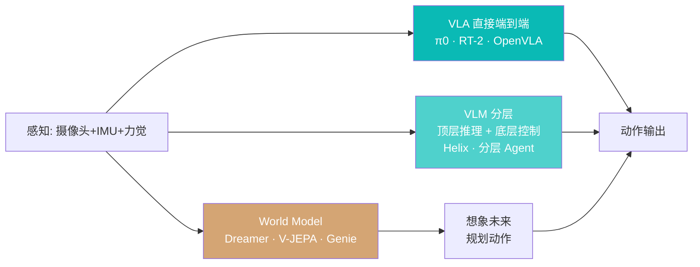

# 具身智能技术路线：VLA / VLM / World Model

> 最后更新：2026-04-22
>
> 本文是**具身智能板块**入口总览。具身智能（Embodied AI）是**机器人能不能真正"活在物理世界里"的大脑问题**。硬件视角见 [人形机器人行业格局](../../02_机器人/01_市场与格局/人形格局2026.md)，本文聚焦**算法路线**与**产业玩家**。

## 摘要（TL;DR）

1. **路线未收敛**：2026 年初的具身智能类似 2020 年的大模型——**多条路线并行**（VLA / VLM + 动作头 / World Model / 端到端模仿学习），尚未出现"Transformer 一统江湖"的时刻。
2. **数据是第一瓶颈**：与 LLM 不同，**互联网上没有机器人数据**。头部玩家砸重金采集真机 / 遥操作 / 仿真数据——**Physical Intelligence 已累积 10,000+ 小时真机数据**，规模化难点在这。
3. **产业距离"GPT-3 时刻"还有 12-24 个月**：当前模型在"**已见过的任务**"上可达 85%+ 成功率，但"**零样本新任务**"普遍 <30%。真正的能力拐点**可能在 2026 年下半年 - 2027 年**到来。

---

## 一、三条主路线对比

### 路线 A · VLA（Vision-Language-Action）端到端

**核心思想**：一个大模型同时吃 (图像, 语言指令)，直接输出**动作 token**。

**代表**：
- **RT-2** (Google DeepMind, 2023)：首个以 PaLI-X 为底座的 VLA
- **OpenVLA** (Stanford, 2024)：7B 开源
- **π0 / π0.5** (Physical Intelligence, 2024-2025)：当前行业最强
- **RDT** (清华，2024)：开源扩散式 VLA
- **CogACT / TinyVLA** 等一众小模型

**优势**：
- 工程简单，一个模型解决从视觉到动作
- Scaling law 类似 LLM，加数据加算力效果显著
- **推理延迟低**（单次前向即出动作）

**劣势**：
- 需要**海量动作-视觉配对数据**（遥操作 + 真机采集）
- 难以在新任务上**零样本泛化**
- 动作空间高维（7-DOF 臂 × 几十 Hz 频率）= 训练不稳定

**适用场景**：重复性强、数据采集成本可控的任务（拣货、流水线、单一家务）。

### 路线 B · VLM + 动作头（分层）

**核心思想**：
- **顶层**：用通用 VLM（GPT / Claude / Gemini）做**任务规划**（"把苹果放到冰箱" → 分解成"找到苹果 → 抓取 → 走到冰箱 → 打开门 → 放入"）
- **底层**：用**小专家模型 / 运控策略**执行每一步

**代表**：
- **Figure Helix** (2025)：System 2（视觉语言理解）+ System 1（200Hz 全身控制）
- **Say-Can** (Google, 2022)：早期代表
- **Voxposer / Code-as-Policies** (2023)：LLM 生成机器人代码
- **NVIDIA GR00T** 走的是"Foundation + Specialist"分层路线

**优势**：
- **充分利用现有 VLM 通识能力**（不用从零训练语言理解）
- 顶层规划易于**调试、审核、打补丁**
- 部署成本低（顶层 API 调用，底层轻量模型）

**劣势**：
- 顶层与底层之间的**接口损耗**（高层推理到低层动作有信息丢失）
- 顶层 VLM 的**延迟可能成为瓶颈**（1-3 秒 vs 需要 200Hz 控制）
- 在**高动态任务**（跑、跳、平衡）上难以做到端到端的流畅

**适用场景**：长时程、多步骤、需要常识推理的任务（家务 / 办公 / 协作）。

### 路线 C · World Model（世界模型）

**核心思想**：先学会**预测物理世界下一秒会发生什么**，然后用这个"想象"来**规划动作**。

**代表**：
- **Dreamer 系列** (Hafner et al., DeepMind 路线)：学 latent dynamics
- **V-JEPA** (Meta Yann LeCun, 2024-2025)：视频版 JEPA，无 pixel-level reconstruction
- **Genie / Genie 2** (Google DeepMind, 2024)：给一张图生成可交互 2D/3D 世界
- **Sora / Veo** 等视频生成被某些研究者视为"隐式 World Model"

**优势**：
- **样本效率高**（模型在"想象中"训练 policy，真机数据需求少）
- 对物理规律的**泛化性**理论上最好
- **LeCun 阵营**的战略方向

**劣势**：
- 技术不成熟，当前模型还做不到高保真长时程预测
- **产业化最早的一条但兑现最慢**
- 计算成本高

**适用场景**：理论价值最高，**短期内更多是研究而非产品**。

---

## 二、数据：具身智能的核心瓶颈

### 数据类型与性价比

| 数据类型 | 单小时成本 | 质量 | 可扩展性 |
|---|---|---|---|
| **真机随机探索** | $10-50 | 低 | 高 |
| **真机遥操作**（VR/手柄） | $50-200 | 中-高 | 中 |
| **真机专家采集** | $200-500+ | 高 | 低 |
| **仿真（Isaac / MuJoCo / Genesis）** | $1-10 | 随物理保真度变化 | 极高 |
| **视频预训练**（YouTube 人类视频） | ~$0 | 质量低（无动作标签） | 极高 |

**产业共识**：单一数据源都不够——**真机 + 仿真 + 视频预训练**混合是标配。详见 [Sim2Real 与仿真平台](../02_数据与仿真/Sim2Real与仿真平台.md)。

### 各家数据规模（截至 2025 末，公开披露）

- **Physical Intelligence (π)**：10,000+ 小时多形态真机数据
- **Figure AI**：大量自有 + 与 Fourier 合作的跨厂数据
- **Google RT 系列**：RT-X Dataset，跨 22 家实验室、22 种机器人、100 万+ episodes
- **Tesla Optimus**：未披露，估计积累最快（FSD 数据架构可复用）
- **中国"国家具身智能创新中心"**：正在建立万亿 token 级具身数据基础设施

### 跨形态迁移

一个大难点：**在 A 机器人上训的模型能不能用在 B 机器人上？**
- RT-X 项目（Google + 21 个实验室）证明**有跨形态迁移性**，但效果大打折扣
- Physical Intelligence 的 π0 设计时考虑了"action tokenization"以适配多形态

---

## 三、玩家格局

### "纯大脑"公司（不做整机）

| 公司 | 定位 | 旗舰模型 |
|---|---|---|
| **Physical Intelligence (π)** | 最像 OpenAI 的具身大脑 | π0 (2024), π0.5 (2025) |
| **Skild AI** | Skild Brain，CMU 系 | Skild Brain v1 |
| **Covariant** | 工业场景 RFM-1 | 被 Amazon 收购核心团队 2024 |
| **Wayve** | 自动驾驶世界模型 | LINGO / GAIA |

详见：[Physical Intelligence](../11_公司研究/Physical_Intelligence.md) · [Skild AI](../11_公司研究/Skild.md) · [Covariant](../11_公司研究/Covariant.md) · [Wayve](../11_公司研究/Wayve.md)

### "大脑 + 身体"一体化玩家

- **Figure AI**（Helix + Figure 02/03）
- **Tesla**（Optimus + 端到端 FSD 复用）
- **1X Technologies**（NEO + 自研具身模型）
- **银河通用 Galbot**（中国代表，硬件 + Galbot-1 模型）
- **智元机器人 / 宇树** 也在建自己的具身模型

### 科研主导的"事实标准"

- **Google DeepMind** RT / Gemini Robotics 系列
- **NVIDIA** Isaac + GR00T 基础模型
- **清华 RDT**、**上海 AI Lab**、**北大具身智能团队**、**UC Berkeley**、**Stanford**、**CMU** 的学术组

---

## 四、能力基准

### 常用 benchmark

| 基准 | 测什么 | 头部成绩（2025 末） |
|---|---|---|
| **RT-2 / CALVIN** | 桌面操作 | 80-95%（已见任务） |
| **RLBench** | 多任务仿真 | 60-80% |
| **BEHAVIOR-1k** (Stanford) | 家庭长时程 | 30-50% |
| **RoboCasa** | 厨房场景 | 40-60% |
| **LIBERO** | 任务泛化 | 70-85%（已见），<30%（零样本） |
| **OSWorld / BEHAVIOR** | 长时程 | <20% |

详见 [具身智能评测基准](评测基准.md)。

### 重要观察

- **"拣一个物体"已接近解决**
- **"完成一个家庭任务"（如做早餐、整理房间）远未解决**
- **长时程 × 零样本 = 当前短板**

---

## 五、2026 的关键变量

### 1. Physical Intelligence 下一代模型
- π0 / π0.5 已震撼，**π1** 若在 2026 年发布并保持数量级能力提升，行业会正式迎来"GPT-3 时刻"
- 估值已达 **~$5B** (2025 Nov, Series C)，Amazon 投资

### 2. Skild AI 与 Figure 的对打
- 两条路线（泛化大脑 vs 整机一体）的**第一次正面 PK**
- 2026 年双方都有产品落地节点

### 3. Gemini Robotics / GR00T 的公开进展
- Google DeepMind 2025 年底发布 Gemini Robotics，能力给业界惊喜
- NVIDIA GR00T 作为**开放平台**策略，可能形成类似 Android 的生态

### 4. 数据基础设施
- 开源大规模数据集（如 Open X-Embodiment）是否继续扩张
- 中国能不能建成真正的"具身数据高速公路"

### 5. 仿真真实性的跃升
- NVIDIA Isaac、Genesis（CMU 2024 开源）、Meta Habitat 等不断逼近物理真实
- **Sim2Real gap 如果缩到 5% 以内**，训练成本下降一个数量级

---

## 六、我的判断

> **我的看法**：
>
> 1. **具身大模型不是"Transformer 一统江湖"式的突破路径**，更像化学工业——**多条工艺路线并存，每条都有适配场景**。VLA 会在"重复性强、数据可收集"的场景先赢；VLM + 动作头会在"家庭长时程"场景赢；World Model 仍处研究阶段
> 2. **"专门搞大脑不搞身体"的商业模式很艰难**—— Physical Intelligence 的生态依赖度太高，不自建整机就永远是 2B 供应商。**Skild 和 π 都会在 2026-2027 有"要不要做整机"的战略选择**
> 3. **中国在这一轮会比 LLM 时代追得更快**—— 因为数据采集场景（工厂、仓库、家庭）中国本来就有优势，而不是像 LLM 那样需要海量英文互联网语料
>
> **我可能错在哪里**：
>
> - **World Model 路线可能突然崛起**：Yann LeCun 押的方向如果某一代（V-JEPA v3 或类似）跑出惊艳结果，格局会被重写
> - **"端到端"可能是正解**：Tesla 在自动驾驶上证明了"足够多数据 + 足够大模型 + 端到端" 能碾压模块化路线——Optimus 如果延续这条路径在 2027-2028 兑现，其他分层路线会尴尬
> - **泛化性的门槛可能更低也可能更高**：目前对"零样本新任务"的预期不是 60%（高估）就是 10%（低估），真实值可能在中间但分布很重要

---

## 七、延伸阅读

**同板块深度**：
- [Sim2Real 与仿真平台：Isaac / MuJoCo / Genesis](../02_数据与仿真/Sim2Real与仿真平台.md)
- [具身智能数据采集：遥操作 / 仿真 / 真机](../02_数据与仿真/数据采集.md)
- [具身智能评测基准](评测基准.md)
- [具身基础模型的 Scaling Law 讨论](Scaling_Law讨论.md)

**公司级**：
- [Physical Intelligence (π)](../11_公司研究/Physical_Intelligence.md) · [Skild AI](../11_公司研究/Skild.md)
- [Covariant](../11_公司研究/Covariant.md) · [Wayve](../11_公司研究/Wayve.md)
- [银河通用 Galbot](../11_公司研究/银河通用.md)

**产品 / 模型**：
- [π0 与 π0.5](../12_产品研究/π0.md) · [Helix (Figure)](../12_产品研究/Helix.md)
- [GR00T (NVIDIA)](../12_产品研究/GR00T.md) · [RT-2 / OpenVLA](../12_产品研究/RT2_OpenVLA.md)

**交叉**：
- [人形机器人行业格局 2026](../../02_机器人/01_市场与格局/人形格局2026.md) —— 从硬件角度看同一产业

---

## 信息源

- **Physical Intelligence blog** · **Figure AI blog** · **Google DeepMind Robotics blog**
- **arXiv cs.RO** · **RSS / CoRL / ICRA** 论文
- **Open X-Embodiment** 开源数据集与项目报告
- **NVIDIA GTC 2025** Keynote（Isaac / GR00T 路线图）
- **Import AI** (Jack Clark) · **Interconnects** · **Ahead of AI** 相关专栏
- **机器之心 · 具身智能**板块中文追踪
