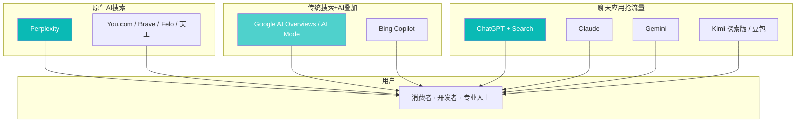

# 生成式搜索革命：Perplexity / SearchGPT / AI Overviews

> 最后更新：2026-04-22
>
> 本文是 **AI 互联网板块**入口总览，聚焦**搜索这个 $250B 的流量入口正在被 AI 重写**这件事。

## 摘要（TL;DR）

1. **Google 的垄断正在松动**（不等于"被推翻"）。Google 搜索全球份额 **2024 年仍有 ~90%**（StatCounter），但**用户在 AI 工具里开始做搜索**的行为拐点已经发生——ChatGPT 周活 **~800M**（2025 Q3，OpenAI 披露），Perplexity 月搜索量 **~7.5B**（2025 末官方披露 vs 2023 同期 500M），两年增长 15x。
2. **格局为"三层并存"**：
   - **原生 AI 搜索引擎**（Perplexity、You.com、天工、Felo）——专门为生成式体验重构
   - **传统搜索 + AI 叠加**（Google AI Overviews、Bing Copilot、Yandex）——防守
   - **ChatGPT / Claude / Gemini 直接抢流量**——用户跳过搜索直接问
3. **商业模型未定**。**广告模型是否能复刻**是核心问题——Google 年广告收入 **~$265B**（2024 年全年），如果 AI 搜索的 CPM 只能做到传统搜索的 30-50%，**全行业广告收入会明显下滑**。

---

## 一、三层格局

---

## 二、玩家与战况

### 原生 AI 搜索引擎

#### Perplexity
- 最大 / 最知名的独立玩家
- 2025 末估值 **~$18B**（多轮次 Series E），产品线：Perplexity Pro（订阅）+ API + **Comet 浏览器**
- 商业路径：**订阅 + 广告（2025 末开始 sponsored answers）+ 硬件（Comet）**
- 强项：用户对"可信搜索答案"的品牌认知；引用完整；垂直模板（Finance、Academic）
- 弱项：**亏损严重**，流量增长但变现未验证；**被 Google / OpenAI 挤压中间位**

详见 [Perplexity 公司调研](../11_公司研究/Perplexity.md) · [Perplexity Pro 与 Comet 浏览器](../12_产品研究/Perplexity_Pro.md)

#### 其他原生 AI 搜索
- **You.com**：美国早期 AI 搜索，2025 转向 B2B 企业搜索
- **Brave Search**：隐私优先，独立索引
- **Felo**（日本初创）：东亚市场有存在感
- **Genspark**（AI Factory 概念）
- **Phind**：开发者向搜索
- **Kagi**：付费无广告搜索（高端利基）

#### 中国
- **天工 AI 搜索**（昆仑万维）、**秘塔 AI 搜索**、**360 AI 搜索**、**搜狐简单搜索**
- **主流 AI 助手里的搜索能力**：豆包、Kimi、文心一言、通义、元宝、智谱清言

### 传统搜索 + AI 叠加

#### Google AI Overviews / AI Mode
- 2024-05 AI Overviews 全美上线，2025 年扩展到 **100+ 国家、50+ 语言**
- **AI Mode**（2025 发布）提供完整对话式搜索体验（类似 Perplexity）
- **核心争议**：AI Overviews 导致**大量传统网站流量下降**（SISTRIX 等第三方数据显示新闻 / 知识类站点 CTR 下降 30-50%）
- Google 仍然是**搜索变现能力最强的**——AI 叠加后广告仍然工作

详见 [Google AI Overviews](../12_产品研究/Google_AI_Overviews.md)

#### Microsoft Bing Copilot / Copilot Pages
- 微软把 Copilot 深度整合到 Bing、Edge、Windows
- 核心差异：**Office 生态的上下文**（你的邮件、文档、会议）让搜索更有用
- 市场份额提升有限但**企业场景渗透**是战略意义上的胜利

#### Yandex / Naver / Baidu
- 俄罗斯（Yandex）、韩国（Naver）、中国（百度）在各自市场继续有主导地位
- **百度文心一言 + 搜索整合**进展有限，中文 AI 搜索正被豆包 / Kimi 等后来者分食

### 聊天应用抢流量

#### ChatGPT
- **周活 ~800M**（2025 Q3）
- **ChatGPT Search** 内置搜索能力，底层 Bing + 自研
- 大量用户已经**把 ChatGPT 当作 Google 的替代**
- 详见 [ChatGPT 作为互联网入口的演变](../12_产品研究/ChatGPT作为入口.md)

#### Claude
- 2025 年引入 Web Search
- 差异化：**不以搜索为主要产品**，定位更工作/创造型

#### Gemini
- Google 亲儿子但节奏被 AI Overviews 抢走
- **与 Chrome、Android、Workspace 的深度整合**是未来杀器

#### Kimi 探索版 / 豆包 / 元宝
- 中文 AI 搜索主力
- Kimi 探索版以"**深度研究**"模式获得专业用户青睐
- 详见 [Kimi 探索版](../12_产品研究/Kimi探索版.md)

---

## 三、核心争议 1：广告模式是否能复制？

### 传统搜索广告的逻辑

- Google 搜索广告 **CPM ~$30+**（随关键词波动很大）
- 商业关键词（如 "insurance"、"lawyer"、"mortgage"）**CPC 可达 $20-100**
- 2024 年全年 Google Ads 收入 **$265B**，其中搜索业务是大头

### AI 搜索的广告挑战

1. **注意力模型变了**：传统搜索用户看 10 条链接，广告插在其中；AI 搜索给一个直接答案，**广告放在哪？**
2. **点击率下降**：AI 摘要已回答问题，用户不点击外链
3. **品牌曝光下降**：广告主无法控制自己在 AI 摘要中的呈现方式
4. **归因困难**：用户从 AI 答案转化到购买，链路不透明

### 正在尝试的方案

- **Sponsored Follow-up Questions**（Perplexity 2025 上线）：广告主赞助特定问题
- **Inline Recommendation**（早期）：AI 答案里嵌入商品卡片
- **Affiliate Link**：Perplexity Shopping、Bing Buy
- **广告商 API**：广告主上传结构化数据让 AI "知道它们"（Google 已在做）

**当前共识**：**没有人真正搞清楚 AI 搜索的广告模型**。最可能的终局是**"答案广告"成为新一代 CPM**，但单价会低于传统搜索的黄金水平。

---

## 四、核心争议 2：生态影响

### 对内容生产者的冲击

- **博客 / 知识站 / 媒体**流量明显下降——AI 摘要"吃掉答案"
- **Stack Overflow 访问量 2023-2024 年暴跌**，被 ChatGPT / Copilot 直接替代
- **SEO 行业**进入"AEO"（AI Answer Optimization）时代

### 对开放互联网的冲击

- 爬虫合规性：OpenAI、Anthropic、Perplexity 与大型媒体的**许可协议**逐渐普及
- **纽约时报诉 OpenAI**（2023 起）推动了行业规范
- **robots.txt** 约束不足，技术侧 + 法律侧博弈继续

### 对浏览器格局的冲击

- **Perplexity Comet**、**The Browser Company Arc / Dia**、**Brave** —— AI 浏览器成为新战场
- 传统 Chrome 份额仍然 65%+，但**浏览器首页从搜索框变成"问答框"**的趋势已确立
- 详见 [AI 浏览器崛起](AI浏览器崛起.md)

---

## 五、数据一览

### 流量

| 工具 | 2025 月活 / 周活 | 增长 |
|---|---|---|
| Google Search | ~5.3B MAU | 2% YoY |
| ChatGPT | **~800M WAU** | 快速 |
| Perplexity | ~100M MAU（估算） | 快速 |
| Bing（含 Copilot） | ~1.3B MAU | 慢 |
| 百度 | 600M+ MAU | 下滑 |

*注：不同来源披露口径不一，以上为多方综合估计*

### 查询量

| 工具 | 月查询 |
|---|---|
| Google | ~400B+ |
| Perplexity | ~7.5B（2025 末官方披露） |
| ChatGPT | 远超 Perplexity，但不单独计"搜索"查询 |
| Kimi / 豆包 | 各约数亿至十亿级 |

---

## 六、2026 的关键变量

### 1. Google AI Mode 的放量速度
- AI Overviews 已是 Google 搜索"新默认"，**AI Mode**（完整 AI 搜索页面）推得多快决定 Google 的变现修正曲线

### 2. Perplexity 是否找到商业模型
- 2025 末广告 + 订阅双轨启动
- **Comet 浏览器**若成功会重新定义商业模式
- 若失败，**估值可能大幅回撤**（当前 $18B 对应的收入尚不清晰）

### 3. Agent Browsing 是否爆发
- OpenAI ChatGPT Agent、Anthropic Claude Computer Use 等 Agent 功能成熟后，**"用户直接委托 AI 完成搜索+决策+执行"**
- 这会进一步削弱点击型广告，**但可能催生新的"代理佣金"模式**

### 4. 内容方与 AI 公司的关系
- 大型媒体（NYT、WSJ、Condé Nast）vs AI 公司的诉讼与许可协议走向
- **Anthropic / Perplexity 已签多家大型新闻媒体**；OpenAI 仍有若干重要诉讼在身

### 5. 中国搜索格局重构
- 百度的位置将被豆包 / Kimi / 元宝 / 文心 / 通义进一步稀释
- **谁能成为"中文世界的 Perplexity"** 仍未有定论

---

## 七、我的判断

> **我的看法**：
>
> 1. **Google 搜索不会"被推翻"**——核心原因是**默认位置**（Chrome、Android、iOS Safari 交易）+ **索引规模**。但 Google 的**广告毛利率拐点已经到来**——AI Overviews 等于用更高的成本换同样的查询收入
> 2. **Perplexity 是"新品类赢家"而非"替代 Google"的公司**——它的 7.5B 年搜索量在 Google 的 5T+ 量级面前仍很小；但它代表了**专业级、可信引用的搜索**这个新品类
> 3. **"AI 搜索"和"AI 聊天"长期会融合**——用户不会区分"我在搜索还是在聊天"；所有聊天工具都会带搜索，所有搜索工具都会更会话化
> 4. **商业模式的终局是"多重变现"**——订阅（专业用户）+ 广告（消费场景）+ 佣金（交易场景）+ API（开发者）。**纯订阅养不起 Perplexity 这种量级公司**
>
> **我可能错在哪里**：
>
> - **Google 的生态可能更脆弱**：如果 **iPhone 把默认搜索引擎换成 ChatGPT**（Apple-OpenAI 合作已在 Siri 层面发生），Google 每年**几百亿美元**的默认搜索分成会重新洗牌
> - **AI 浏览器可能比我预期的更快颠覆**：Arc、Comet、Dia 任一家跑出真正的"代理浏览"体验，传统搜索跳转模式会在 2-3 年内大幅削弱
> - **广告变现可能达不到 Google 的水平**——**整个互联网广告 pie 会缩小**，而不只是 pie 的分配改变

---

## 八、延伸阅读

**同板块深度**：
- [AI 浏览器崛起：Comet / Arc / Dia](AI浏览器崛起.md)
- [AI Coding 产品格局](../02_产品品类/AI_Coding产品格局.md)
- [广告 vs 订阅：AI 产品商业模式](../03_商业与地理/AI产品商业模式.md)
- [中国 AI 应用层大战：豆包 / Kimi / 元宝 / 通义](../03_商业与地理/中国AI应用层大战.md)

**公司级**：
- [Perplexity 公司篇](../11_公司研究/Perplexity.md)
- [The Browser Company (Arc / Dia)](../11_公司研究/The_Browser_Company.md)
- [Anysphere (Cursor)](../11_公司研究/Anysphere.md)

**产品级**：
- [Perplexity Pro 与 Comet 浏览器](../12_产品研究/Perplexity_Pro.md)
- [ChatGPT 作为互联网入口的演变](../12_产品研究/ChatGPT作为入口.md)
- [Google AI Overviews](../12_产品研究/Google_AI_Overviews.md)
- [Kimi 探索版](../12_产品研究/Kimi探索版.md)

---

## 信息源

- 各公司官方披露（月活、查询量、融资）
- **StatCounter / SimilarWeb / Semrush**：第三方流量数据
- **SISTRIX / Ahrefs**：AI Overviews 对传统网站的影响数据
- **The Information** · Search beat
- **Stratechery**（Ben Thompson）关于搜索商业模式的分析
- **Casey Newton · Platformer**：AI 与内容生态
- **机器之心 · 硅星 GenAI**：中文一手
